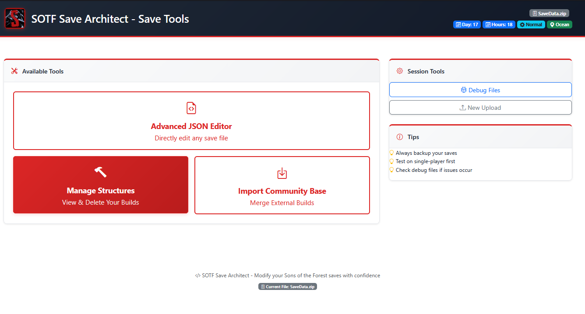

# Sons of the Forest Save Architect


[](https://hub.docker.com/r/k0m16/sotf-save-architect)
[](https://opensource.org/licenses/MIT)

A powerful, web-based save editor for the game *Sons of the Forest*. This tool allows you to safely upload your `SaveData.zip`, perform advanced modifications, and import community-made bases or other ConstructionsSaveData.json with an intelligent merging system.

|  |  |
|------------------------------|------------------------------|
|  |  |
|------------------------------|------------------------------|

---

## 🚀 Installation & Setup

There are three ways to run this editor. **For most users, Method 1 is the fastest and easiest.**
> **⚠️ Warning**: Always back up your original save files. Editing save files can have unintended consequences. Use at your own risk.
---

### **Method 1: Quick Start with Docker (No Code Download Needed)**

This method lets you run the editor anywhere without downloading any source code.

**Prerequisites:**
- [Docker](https://www.docker.com/get-started) & [Docker Compose](https://docs.docker.com/compose/install/)

**Instructions:**

1.  Create an empty folder on your computer for the editor and navigate into it.
    ```bash
    mkdir SOTFSaveArchitect
    cd SOTFSaveArchitect
    ```

2.  Create a file named `docker-compose.yml` and paste the following content into it:
    ```yaml
    # docker-compose.yml
    services:
      sotf-save-architect:
        image: k0m16/sotf-save-architect:latest
        container_name: sotf-save-architect
        ports:
          - "5000:5000"
        volumes:
          # Creates an 'uploads' folder here to store temporary files.
          - ./uploads:/app/uploads
        env_file:
          - .env
        restart: unless-stopped
    ```

3.  Create another file named `.env` for your secret key.
    -   Generate a secure key by running this command in your terminal:
        ```bash
        openssl rand -hex 32
        ```
    -   Paste the key into the `.env` file like this:
        ```ini
        # .env
        SOTFSE_SECRET_KEY=PASTE_YOUR_GENERATED_KEY_HERE
        ```

4.  Start the application!
    ```bash
    docker compose up -d
    ```

5.  The editor is now running at **`http://localhost:5000`**.

---

### **Method 3: From Source (For Developers)**

This method is for developers who want to modify or contribute to the application code.

**Instructions:**

1.  Clone this repository:
    ```bash
    git clone https://github.com/Kevin0M16/SOTFSaveArchitect.git
    cd SOTFSaveArchitect
    ```
2.  Create and activate a Python virtual environment.
    ```bash
    # On Windows: python -m venv venv && .\venv\Scripts\activate
    # On macOS/Linux: python3 -m venv venv && source venv/bin/activate
    ```
3.  Install the dependencies: `pip install -r requirements.txt`
4.  Set the `SOTFSE_SECRET_KEY` environment variable:
    ```bash
    # On Windows (PowerShell): $env:SOTFSE_SECRET_KEY=$(openssl rand -hex 32)
    # On macOS/Linux: export SOTFSE_SECRET_KEY=$(openssl rand -hex 32)
    ```
5.  Run the Flask application: `python app.py`
6.  The editor will be running at `http://localhost:5000`.

---

## 📝 How to Use the Editor
> **⚠️ Warning**: Always back up your original save files. Editing save files can have unintended consequences. Use at your own risk.
1.  **Locate Your Save File**: Find `SaveData.zip` in `C:\Users\<YourUsername>\AppData\LocalLow\Endnight\SonsOfTheForest\Saves\...`
2.  **Upload**: Go to the homepage and upload your `SaveData.zip`.
3.  **Choose a Tool**:
    - **Edit Raw JSON**: Modify game files directly.
    - **Import Base**: Merge another ConstructionsSaveData.json or community build into your save.
4.  **Download**: The editor generates a new `SaveData.zip` for you to download.
5.  **Replace**: **BACKUP YOUR ORIGINAL SAVE!** Then, replace the old `SaveData.zip` with your new one.
6.  **Play!**

## ⚖️ License

This project is licensed under the MIT License.

## 🙏 Disclaimer

This is a fan-made project and is not affiliated with Endnight Games.